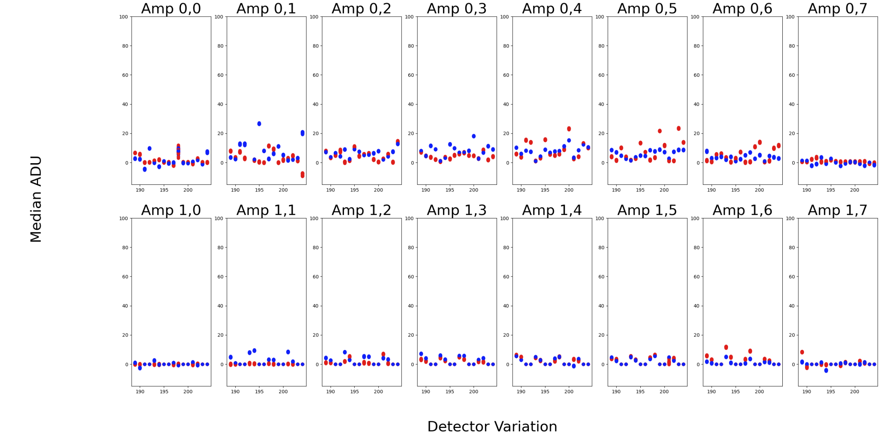

:tocdepth: 1

.. sectnum::

.. Metadata such as the title, authors, and description are set in metadata.yaml

.. TODO: Delete the note below before merging new content to the main branch.

.. note::

   **This technote is a work-in-progress.**

Abstract
========

This technote details investigation into the vertical banding seen in the difference images of master biases at the edge of the amplifier boundaries. 
Previously, this was seen on time scales of about three months. 
Our investigation into the banding expands this to any timescales and finds that the banding changes in signal over time.
We also find that the banding is noticable on timescales of greater than 10 days, and maybe related to the ambient temperature as the WREB is not cooled.

Motivation
================
While ComCam and LSSTCam are not yet opertaional, AuxTel/LATISS has proved to be a useful pathfinder into solving potential issues of the main camera.
One potential issue would be the stability of the calibartion products used to reduce the data.
As shown in previous work, the stability of biases are currently unknown.
The following figure shows the difference images of master biases taken at different times.

.. INSERT INITIAL BIAS DIFFERENCE IMAGES here.

.. figure:: Initial_Subtraction.png

   Images displaying the original investigation into the stability of biases using master biases from multiple epochs.
   The left image shows a subtraction taken days apart and the banding is not visibly present.
   The middle and right images show subtractions from master biases created from data three monthes apart. 
   These images show that the banding can have an excess/lack of signal between epochs, respectively.

These images show that there is an excess/lack of signal in the last columns of each amplifier or time (in this case, a few months).
We wanted to investigate the timescales that this excess/lack occurs to determine the stability of the biases and possible causes for this banding.

Investigation
================

Calibrated Images 
-----------------

We first investigated this banding using calibrated images from the mKids survey (SITCOM-). 
Measuring the last two columns of each amplifier, we found evidence that the banding had changed over timescales of X days as seen in the figure below.

..INSERT INITIAL BANDING FIGURE

.. figure:: Calibrated_Banding.png

   This figure shows the changes in banding of calibrated science images over the course of a couple months.
   These changes are on shorter timescales than previously identified.

While this does show evidence of the temporal changes of the vertical banding, we wanted to insure that this effect was also seen in the biases.

Biases 
----------------

To investigate the veritcal banding further, we analyzed the banding in raw biases using DM procedures for ISR.
We again use the the last two columns to measure the change in the banding over time. 
The configuration file and the columns for each amplifiers are highlighted in the figure below.

.. INSERT IMAGES FROM BIAS PROCEDURE SLIDE

.. figure:: Bias_Procedure.png

   Left: The configuration for running the ISR task on the raw biases. 
   Right: An example processed bias using the configuration. The red corresponds to the columns used to measure the banding.

We did this for all biases taken from January to August 2022 and then for all biases taken in 2021.
These are highlighted in the figure below, showing the median of the signal in the last two columns in blue and the median signal for the entire amplifier in orange.

.. INSERT LONG TERM Banding EFFECTS IMAGES for 2022 and 2021

.. figure:: 2022_Banding.png

   This figure shows the changes in the banding from January to August of 2022. 
   The median of the last two columns of each amplifier are shown in blue and the median of the entire amplifier in orange.

The trend for the 2022 images is an increased signal over time. 
This would explain the excess signal sometimes found between master biases.
However, this does not explain the lack of signal sometimes found.
Expanding to a full year however (as seen below), and the trend becomes parabolic instead of linear, offering an explanation to the lack of signal found between master biases.

.. figure:: 2021_Banding.png

   This figure shows the changes in the banding for the entire year of 2021. 
   The median of the last two columns of each amplifier are shown in blue and the median of the entire amplifier in orange.

Avenues Moving Forward
=======================

While simply masking the last two columns is an option, two other options are highlighted below.

Parallel Overscan
--------------------

One option would be to apply a parallel overscan correction. 
If this is applied, the banding disappears for all biases no longer have this banding, as seen for the 2022 data.

.. INSERT Parallel Overscan IMAGES HERE

.. figure:: Parallel_Overscan_Bias.png

   Left: An example processed bias with parallel overscan correction turned on.
   Right: The trend in the banding from January to August 2022 with parallel overscan correction.

While this does eliminate the vertical banding problem, parallel overscan does also remove other important features that could be useful for calibration purposes.

Validity Range
--------------------
Another option is to change the validity ranges of the master biases. 
As seen in the first figure, the vertical banding is not present from day to day biases.
As such, we tried to determine how many days a master bias created one a single day could be used without the veritcal banding appearing.
Below is a similar figure to the one above, but rebinned to a single day.

..INSERT REBINNED 2022 DATA HERE

.. figure:: Rebin_biases.png

   This figure shows the process of rebinning the bias data taken from February to May 2022.
   The error bars show the scatter of the banding in a given day.

Using this rebinned data, we compared various epochs to each other to determine how many days it took before the difference in banding was a certain sigma above the noise.
This is highlighted in the following figure. 

.. INSERT HISTOGRAM FIGURE

.. figure:: Validity_Biases.png

   This figure shows how many days after a particular epoch that 1, 4, and 8 amplifiers show banding above 1, 2, and 3 sigma above the intrinsic scatter between epochs.

This shows how many days it took for the banding difference in 1, 4, and 8 amplifiers to be above 1, 2, and 3 sigma.
As can be seen, most detectors start to have the banding present across multiple amplifiers after a few days.
We would recommend creating master biases every 10 days (or more often) to try and offset the banding.

Possible Temperture Corelation
===============================

WREB Temperature vs Banding Signal 
----------------------------------

One of the possible causes of this effect could be that the WREB for LATISS is not cooled.
The change in the ambient temperature over the year could then explain the parabolic shape of the banding strength.
The figure below shows a correlation plot between the banding signal and the temperature of the WREB (taken from the EFD data).

..INSERT EFD CORRELATION plot

.. figure:: EFD_WREB_Temp_v_Banding.png

   This figure shows the relation between WREB temperature and the edge of amplifier banding for each amplifier.
   The data has been binned to 8 hours.

This plot is rebinned to average the banding signal and temperature in 8 hours bins.
This shows evidence that the banding signal is negative correlated to the temperature of the WREB.

LSSTCam Comparison 
----------------------
Another piece of evidence that this might be an effect of the LATISS WREB not being cooled is that this banding is not present in the corner raft detectors on the LSSTCam.
These detectors also have an WREB but are cooled by the cryostat.
The figure below shows the banding in each amplifier on the y axis and the x axis shows the detector number correspsonding to LSSTCam corner raft detectors.

.. INSERT LSSTCam Detector Banding here

   This figure shows the banding present for LSSTCam corner raft detectors that have a WREB.

This shows that while there is some evidence of the banding happening in the LSSTCam detectors, it is much less noticeable as compared to the LATISS detector.

.. Make in-text citations with: :cite:`bibkey`.
.. Uncomment to use citations
.. .. rubric:: References
.. 
.. .. bibliography:: local.bib lsstbib/books.bib lsstbib/lsst.bib lsstbib/lsst-dm.bib lsstbib/refs.bib lsstbib/refs_ads.bib
..    :style: lsst_aa

.. Add content here.
.. See the `reStructuredText Style Guide <https://developer.lsst.io/restructuredtext/style.html>`__ to learn how to create sections, links, images, tables, equations, and more.
